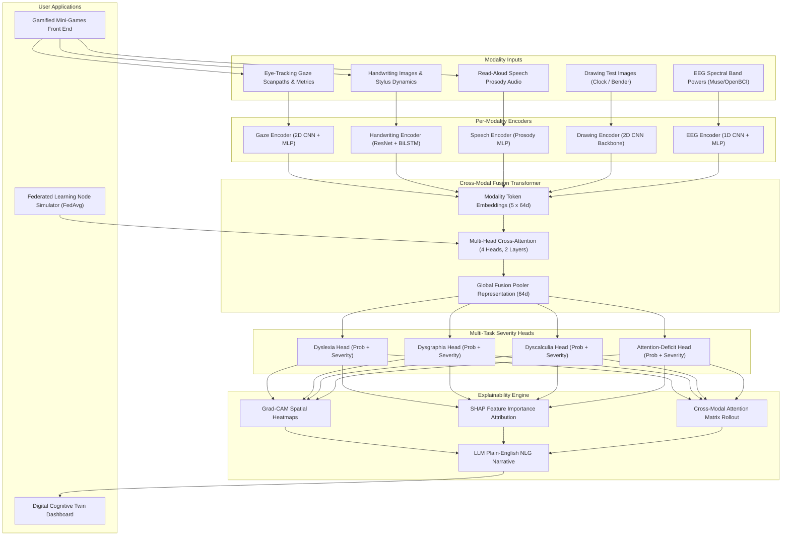

# NeuroLens End-to-End System Architecture

```mermaid
graph TD
    subgraph Modality Inputs
        A1["Eye-Tracking Gaze Scanpaths & Metrics"]
        A2["Handwriting Images & Stylus Dynamics"]
        A3["Read-Aloud Speech Prosody Audio"]
        A4["Drawing Test Images (Clock / Bender)"]
        A5["EEG Spectral Band Powers (Muse/OpenBCI)"]
    end

    subgraph Per-Modality Encoders
        B1["Gaze Encoder (2D CNN + MLP)"]
        B2["Handwriting Encoder (ResNet + BiLSTM)"]
        B3["Speech Encoder (Prosody MLP)"]
        B4["Drawing Encoder (2D CNN Backbone)"]
        B5["EEG Encoder (1D CNN + MLP)"]
    end

    A1 --> B1
    A2 --> B2
    A3 --> B3
    A4 --> B4
    A5 --> B5

    subgraph Cross-Modal Fusion Transformer
        C1["Modality Token Embeddings (5 x 64d)"]
        C2["Multi-Head Cross-Attention (4 Heads, 2 Layers)"]
        C3["Global Fusion Pooler Representation (64d)"]
        B1 & B2 & B3 & B4 & B5 --> C1
        C1 --> C2 --> C3
    end

    subgraph Multi-Task Severity Heads
        D1["Dyslexia Head (Prob + Severity)"]
        D2["Dysgraphia Head (Prob + Severity)"]
        D3["Dyscalculia Head (Prob + Severity)"]
        D4["Attention-Deficit Head (Prob + Severity)"]
        C3 --> D1 & D2 & D3 & D4
    end

    subgraph Explainability Engine
        E1["Grad-CAM Spatial Heatmaps"]
        E2["SHAP Feature Importance Attribution"]
        E3["Cross-Modal Attention Matrix Rollout"]
        E4["LLM Plain-English NLG Narrative"]
        D1 & D2 & D3 & D4 --> E1 & E2 & E3
        E1 & E2 & E3 --> E4
    end

    subgraph User Applications
        F1["Gamified Mini-Games Front End"]
        F2["Digital Cognitive Twin Dashboard"]
        F3["Federated Learning Node Simulator (FedAvg)"]
        E4 --> F2
        F1 --> A1 & A2 & A3
        F3 --> C2
    end
```
